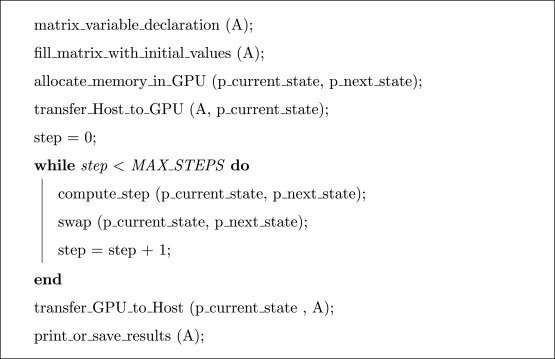

# Day 13
## Celluar Automation on GPUS
### https://www.sciencedirect.com/science/article/pii/S1569190X22000259
* Papers typically focus on Conway's GoL
    * This doesn't feel like the perfect anolog for us 
* Two boards - current board and next board defined in memory
    * 
* We need to minimize the number of transfers between the CPU and the GPU
    * this means the number of iterations/steps needs to be high otherwise it will be slower 
* 